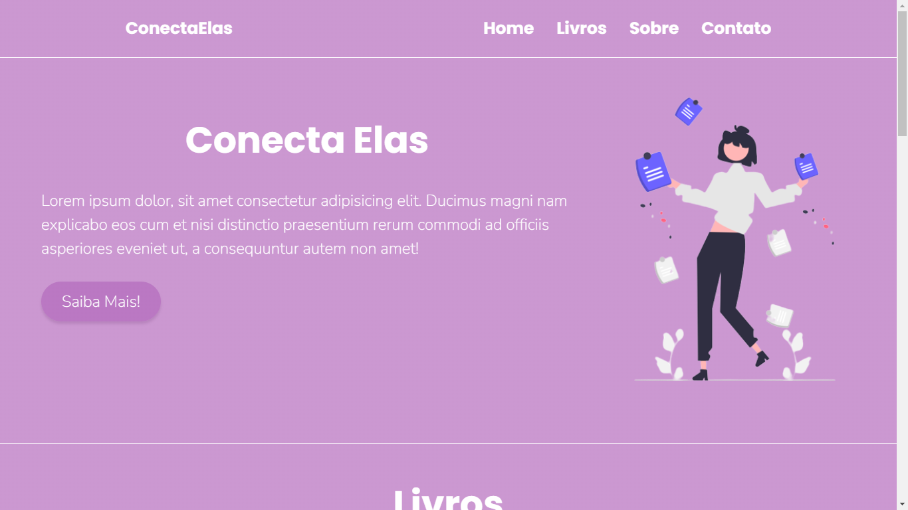

# Landing Page - ConectaElas
Objetivo: Desafio proposto no webinar "[Como desenvolver uma landing page de sucesso](https://ebaconline.com.br/webinars/programacao-workshop-2022-03-08-09-10)" pela Laiza Benevides Sobra. Criar uma Landing page para o Projeto ConecteElas com um forms para o pedido dos livros.

## Aprendizados

- Desenvolvi UI Design pelo Figma por conta própria
- Melhor entendimento sobre programar um Website seguindo um UI Design proposto
- Trabalhar e estilizar um form

## Demonstração

[Acesse Aqui a Landing Page Conecta Elas](https://landing-pages-conectaelas.vercel.app/)

[Acesse Aqui UI design](https://www.figma.com/community/file/1086278106153063416/Prot%C3%B3tipo-LandingPage-DesafioConecteElas)

## Autora

- [@ibtriz](https://www.github.com/ibtriz)

## Stack utilizada

**Front-end:** HTML, CSS

## Referência

- [Como desenvolver uma landing page de sucesso](https://ebaconline.com.br/webinars/programacao-workshop-2022-03-08-09-10)

